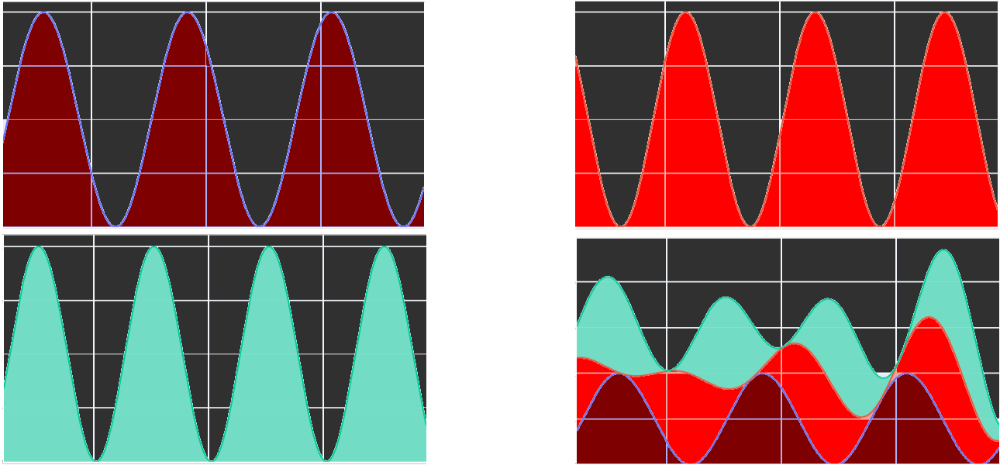
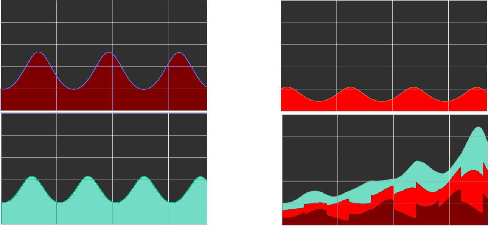
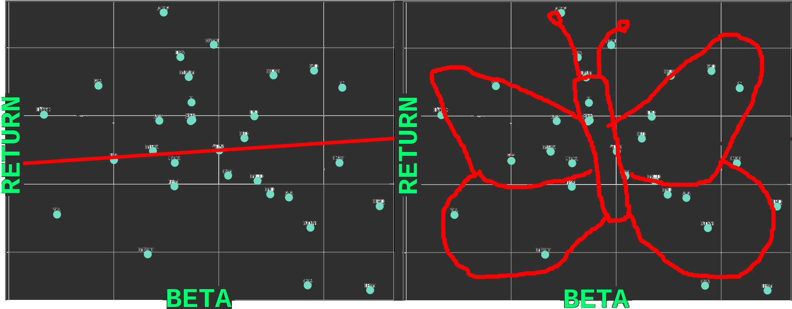

Title:        Investing
Author:       Luca Pizzagalli
Date:         2021-07-02
Language:     it
Comment:      https://fletcher.github.io/MultiMarkdown-6/syntax/index.html
CSS:          ../retro.css
HTML header:  
              
              <svg xmlns="http://www.w3.org/2000/svg" version="1.1">
                <defs>
                  <filter id="retro-image-filter" filterUnits="objectBoundingBox" primitiveUnits="userSpaceOnUse" color-interpolation-filters="sRGB">
                    <feColorMatrix type="matrix" values="
                      1 0 0 0 0
                      1 0 0 0 0
                      1 0 0 0 0
                      0 0 0 1 0" in="SourceGraphic" />
                    <feComponentTransfer>
                      <feFuncR type="table" tableValues="0.4 0"/>
                      <feFuncG type="table" tableValues="0.4 1"/>
                      <feFuncB type="table" tableValues="0.4 0.44"/>
                      <feFuncA type="table" tableValues="0 1"/>
                    </feComponentTransfer>
                    <feBlend in2="SourceGraphic" mode="hue"/>
                  </filter>
                  <filter id="noise2-filter" x="-10%" y="-10%" width="120%" height="120%">
                    <feTurbulence baseFrequency="0.01 0.4" result="turbulence" numOctaves="2" />
                    <feDisplacementMap in="SourceGraphic" in2="turbulence" scale="12" xChannelSelector="R" yChannelSelector="R">
                    </feDisplacementMap>
                  </filter>
                  <filter id="noise-filter">
                    <feTurbulence baseFrequency="0.60,0.90" />
                    <feColorMatrix type="matrix" values="
                      .33 .33 .33 0 0
                      .33 .33 .33 0 0
                      .33 .33 .33 0 0
                      0 0 0 2 0"/>
                    <feComposite operator="in" in2="SourceGraphic"/>
                    <feBlend in2="SourceGraphic" mode="multiply" />
                  </filter>
                </defs>
              </svg>

# The one weird trick gli hedge fund manager ti vogliono nascondere

## Investire in borsa

*Investire in borsa è tattico.*

Altre forme di investimento sono problematiche da gestire. Ad esempio comprare un locale ed affittarlo: Mi lega ad un luogo fisico, comporta scazzi da gestire periodicamente, l’ammontare dell’investimento è fisso e non scala, la durata dell’investimento non è facilmente regolabile. Prima i soldi vengono investiti, meglio è, la non possibilità di investire periodicamente le nuove entrate ha un costo in missing returns. In borsa posso invece: investire la quantità che preferisco, aumentare l’investimento gradualmente, ritirare quando voglio, fare tutto ciò da un qualsiasi posto nel mondo. Inoltre le commissioni sono 0 e le tasse sono solo sui profitti, Questo rende cambiare idea praticamente gratis. Esistono indubbiamente investimenti migliori, ma non ne sono a conoscenza, se un giorno lo sarò, potrò pivotare.

Day trading, market timing, stock picking, technical trading, sono l’equivalente di “enlarge your penis”, tutta fuffa[#day-trading-video][#picking-stock-video][#market-timing-video][#no-technical-trading][#enlarge-penis]. L’"efficient-market hypothesis"[#EMH] sembra essere approssimativamente vera, ciò implica che non c’è spazio per questi giochetti, almeno non a un basso livello amatoriale.

E allora perché investire in borsa dovrebbe farmi guadagnare? Storicamente l’umanità ha continuato a progredire (almeno degli ultimi boh, 2 millenni) e così il valore dei mercati da quando esistono. La borsa non è un zero-sum game e in media tutti ci guadagnano (tolte commissioni e andare short).

## Scegliere come investire

*Ok, allora diciamo che il mercato è efficiente nella determinazione sia del valore attuale sia delle prospettive di crescita, tutta l'informazione disponibile è "priced in" nel prezzo di ogni stock, e le fluttuazioni nei prezzi sono esclusivamente dovute ad acquisizione di nuova informazione non precedentemente disponibile. Questo quindi significa che tutte le strategie sono equivalenti? Prendere uno stock random è una strategia ottimale, come tutte le altre possibili, giusto?*

---

**No.** Il valore da massimizzare non è l’expected return, ma qualcosa di simile al “Risk-adjusted return on capital”[#risk-adjusted-return][#value-at-risk] (che non mi pare un concetto ben definito).
In parole povere: essendoci incertezze, preso uno stock $i$, rappresentiamo il suo return ($r_i$) come un evento stocastico, con una certa distribuzione di probabilità, di media ($\mu_i$) e deviazione standard ($\sigma_i$). L'obiettivo non è semplicemente cercare un investimento che massimizzi la media, ma bensì uno che offra un compromesso fra massimizzare la media e minimizzare la deviazione standard. Cioè vogliamo sì massimizzare i guadagni ma anche ridurre i rischi.

Visto dal mio punto di vista

Questo è perchè la mia objective function è sublineare rispetto al numero di € sul mio conto in banca.
A parità di € regalati, un me povero che possiede 100€ avrà un incremento di felicità maggiore di un me ricco che possiede 1000€.

Tra:

- A: 100€ sicuri
- B: 50% di probabilità di ricevere 50€ e 50% di probabilità di ricevere 150€

L'opzione A è più allettante di B perchè l'aumento di felicità tra gli extra 50€ e gli extra 100€ è maggiore di quello tra gli extra 100€ e gli extra 150€. Ciò significa che la media di felicità nei due sub-casi dell'opzione B è minore della felicità nell'opzione A. La preferenza dell'opzione A mi sembra quindi perfettamente razionale[#loss-aversion].

Quello che io desidero è massimizzare la media della mia objective function (diciamo felicità) calcolata su tutte le mie possibili vite future (e non la media dei soldi sulle mie possibili vite future). Questo si traduce nel compromesso tra massimizzazione di guadagni e riduzione rischi di cui sopra. Quantificare questo compromesso riciederebbe quantificare la object function in funzione del denaro disponibile (esercizio lasciato al lettore).

Qui usiamo la varianza come indicatore di quanto uno stock è volatile e quindi del rischio.

### The only free lunch is diversification[#diversification]

*Mh, ok. Quindi più uno stock è volatile maggiore è il rischio e maggiori saranno i returns medi, giusto?*

---

**Naah, non proprio.** Facciamo un piccolo detour.

Definiamo il retrun del mercato ($r_m$) come la media dei return di tutti gli stock (stock weighted). Il return medio del mercato è uguale alla media su tutti gli stock dei return medi, ma se guardiamo alla varianza del return del mercato, questa è minore della media su tutti gli stock delle varianze dei returns. Forse in formule viene meglio:

$$\begin{align}
& \mu(r_m) := \mu(\overline{r_i}) = \overline{\mu(r_i)} \\
& \sigma(r_m) := \sigma(\overline{r_i}) < \overline{\sigma(r_i)}
\end{align}$$

Questo intuitivamente perchè, quando guardiamo al mercato nel complesso, le oscillazioni dei singoli stock parzialmente si compensano, e il return del mercato è più stabile rispetto a quello dei singoli stock (è un po' il discorso della media campionaria[#error-of-the-mean][#law-of-total-variance]).
Quindi il risk-adjusted return dell’intero mercato è migliore.

Ma non finisce qua. Se un anno ho un return -20% l’anno successivo mi serve un +25% per pareggiare: quando guardo agli interessi su più anni ciò che è importante è la media geometrica, non aritmetica. Una varianza maggiore significa un ritorno complessivo minore, questo effetto è chiamato "volatility tax"[#volatility-tax] e comporta che non solo in un portfolio diversificato i rischi sono minori, ma i ritorni maggiori. Wait, com’è possibile? Mantenere un portfolio diversificato significa periodicamente ribilanciare le proprie azioni. I.e. devo vendere un po’ di azioni degli stock che nell’ultimo mese sono andati bene e comprare quelle di quelli che sono andate male, in modo da mantenere un investimento uniforme sugli stock; questo processo di bilanciamento è quello che mi alza i guadagni[#modern-portfolio-theory](?? this link).

Per vedere quanto il processo di bilanciamento sia importante pensiamola così. Tutte le aziende prima o poi falliscono. Comprando azioni di tutti gli stock esistenti ad un certo punto e semplicemnte tenendoli, prima o poi il valore di tutte andrà a 0. Anche se durante quel periodo il mercato sarà salito, l'unica salvezza è ribilanciare, vendendo parte delle vecchie azioni per comprare stock nascenti.

> The only free lunch is diversification[#diversification]

Il trucco di diversificare il mio portfolio funziona però soltanto fintatno che gli stock che aggiungo non sono correlati tra loro: supponiamo un bel giorno ci sia una crisi economica o una catastrofe, tutto il mercato andrà giù in maniera correlata, e la mia diversificazione non mi aiuta.

Possiamo definire due tipi di rischio: quello dovuto all’imprevedibilità del mercato in toto (systematic risk)[#systematic-risk] e quello dovuto all’imprevedibilità del singolo stock (specific risk)[#specific-risk] che si aggiunge al systematic risk. Il primo non è eliminabile diversificando e riflette le imprevedibilità del mercato finanziario nel suo complesso. Il secondo è la variabilità legata al singolo stock e  può invece essere eliminato diversificando.

## Non tutti gli stock nascono uguali

*Allora update della strategia: tutti gli stock sono equivalenti tra di loro, ma invece di puntare su uno stock a caso conviene diversificare comprando tutti gli stock disponibili sul mercato, in proporzione al loro market cap, in modo da minimizzare i rischi (specifici).*

---

Meglio di prima, ma **nope**. Altro detour.

Noi siamo devoti fedeli dell’efficient market hypothesis, non ci mettiamo a disegnare figurine geometriche sui market chart[#technical-trading-patterns] e crediamo che gli investitori siano enti razionali. Ciò comporta che, ad un rischio maggiore corrisponderanno ritorni maggiori. Abbiamo tuttavia visto come lo specific risk sia eliminabile diversificando, e quindi un rischio che non si riflette sugli investitori razionali che diversificano, quindi una componente di rischio che non aumenta gli expecterd returns. E' solo il non eliminabile systematic risk a cui corrispondono expected returns maggiori.

### Beta Factor

Ci sono stock le cui performances dipendono fortemente dall'andamento dell'economia in generale, altri che sono invece più robusti. Un settore che produce beni di prima necessità non sarà toccato molto da una crisi, al contraro di un settore che si occupa di beni di lusso. Ogni stock ha quindi un suo proprio systematic risk, proprio come .?? ..bambino bello a mamma sua - speciale a modo suo...

Qui entra in gioco il famoso "beta factor"[#beta] che indica quanto un investimento amplifica l'andamento del mercato. Ad esempio se investo i miei soldi in un "value-weighted stock-market index" avrò $\beta = 1$ (per definizione), se tengo tutto in cash ho $\beta = 0$, se faccio metà e metà ho $\beta = 0.5$.

Cash per b=0 non è in realtà un buon esempio. Esistono prodotti finaziari considerati riskless nella pratica[#risk-free-interest-rate][#risk-free-bond], come i bonds emessi dagli Stati Uniti, approssimando la probabilità di bancarotta degli USA a 0. Essendo il rischio e la volatilità 0 (i returns dei bond sono definiti a priori ?? è vero?) anche $beta$ vale 0. Stesso rischio del cash ma ritorni positivi. Questo rende il cash un investimento irrazionale per il nostro modello. Però il cash offre vantaggi differenti, tipo la possibilità di spenderli, i soldi. (Viene un etto e due, lascio? Sì, sì, accettate un duecentoventiseiesimo di bond USA a 30 anni?)

Qui arriva il punto chiave: gli expected returns sono funzione dell rischio, ma solo quello sistematico. Il rischio sistematico è quello dovuto alle fluttuazioni del mercato nel suo complesso, se l'andamento di uno stock è completamente un-correlato con lo stock market, non importa quanto le fluttuazioni sono grandi, il rischio è completamente diversificabile, quindi nullo. Gli investitori compreranno lo stock qualora il prezzo dovesse essere sufficientemente basso da creare l'aspettativa di expected returns leggermente superiori al risk-free-interest-rate, questo induce un aumento del prezzo e quindi riduzione dei returns per capital, riportando i returns al risk-free-interest-rate. Immaginiamo invece ora uno stock che ha lo stesso systematic risk del mercato, il suo prezzo convergerà a un valore tale da rendere i returns uguali a quelli della media del mercato. 

Beta è definita come:

$$\begin{align}
\beta_i & = \frac{Cov(r_i, r_m)}{\sigma^2(r_m)} \\
& = Corr(r_i, r_m) \cdot  \frac{\sigma(r_i)}{\sigma(r_m)}
\end{align}$$

dove $r_i$ è il ritorno per un investimento i, $r_m$ è il ritorno del mercato, $\beta_i$ è la nostra beta che meglio fitta i dati minimizzando l'errore $\epsilon$ ed è il fattore di proporzionalità rispetto all'andamento del mercato di cui parlavamo. E $\alpha_i$? Eh, mmh, facciamo finta sia 0.

$$\mu(r_i) - r_f = \beta \cdot \big(\mu(r_m) - r_f \big)$$

1. Non conosciamo la distribuzione di probabilità dei returns, o la sua $\sigma$. Quello che possiamo fare è solo guardare il passato storico e usare i precedenti returns come un campione estratto da questa distribuzione, per stimarne la $\sigma$ e quindi beta.
3. Tre. Il modello non funziona per un cazzo di niente.

https://www.aeaweb.org/articles?id=10.1257/0895330042162430

Hedge funds, actively managed funds: aka anche i ricchi vogliono il loro “enlarge your penis”. Nonostante l’ efficient-market hypothesis non sia perfettamente soddisfatta, e quindi ci sia teoricamente spazio per fund manager skillati, si vede che i fund manager non sono poi così skillati[#actively-managed-funds-video][#active-managers-video][#hedge-funds-video]. Poi le fees sono alte e non giustificano eventuali marginali guadagni.

Considerazioni etiche: sì ma di fatto, alla fine dei conti, in cosa sto investendo? Lobby di armi che fomenta guerre? Lobby del tabacco che propaganda pubblicazioni biasate? Lobby del pertolio? Vale la pena prestare attenzione alla cosa e scegliere fondi socialmente responsabili o conviene compensare facendo beneficenza?

4 factors

### Questa Efficient Market Hypothesis non mi convince fino in fondo

##### Proprio così, e vorrei farti alcune domande al proposito

Prego.

##### Se ipotizziamo che il mercato sia razionale, e che gli enti razionali investano in passive index funds, allora non esisterebbero trader attivi razionali, non immetterebbero quindi informazione nei prezzi degli stock e il mercato diventerebbe irrazionale

Cosa c'è di più bello di un'ipotesi autoinconsistente per basarci tutti i propri risparmi, vero? Questo ha un nome, sdfsdf, 

##### Un mucchio di esaltati si sono messi d'accordo e hanno investito in massa in Game Stop stock che è salito 1000x, mi spieghi cosa c'è di razionale in ciò?

Io credo: l'investimento iniziale è stato irrazionale e quindi i ricavi fortuiti. O possiamo anche pensare che l'investimetno iniziale è stato fatto dal più intelligente di tutti (l'ipotesi è di efficienza quasi perfetta, Quelli al top con informazizoni più accurate / aggiornate o con capacità di elaborazione / intelligenza / razionalità superiore riscono a fare profitti a scapito degli altri, e sono questi a definire il grazo di razionalità del mercato). Dopodichè si è formato un fenomeno sociologico che non era prima prevedibile (a.k.a. non era previsto dal mercato, se non da questi ipotetici pochi investitori super-razionali) e la nuova informazione sull'esistenza di questo fenomeno, dell'esistenza di investitori disposti ad immolarsi per la "causa", è stata inglobata dal mercato e ha fatto variare il prezzo.

#### Ci credi veramente in quanto hai appena detto?

Insomma.

[#day-trading-video]: <https://www.youtube.com/watch?v=qhHOmZVAqBE>
[#picking-stock-video]: <https://www.youtube.com/watch?v=AecvTErBQY8>
[#market-timing-video]: <https://www.youtube.com/watch?v=w_aOERmUWdA>
[#no-technical-trading]: Questa reference sta a rappresentare l’assenza di evidenza a favore della tesi opposta. Non ho un link che mandi al mio tempo perso a cercarne, ma questo tempo è stato speso, e l’assenza di evidenza è evidenza al contrario
[#technical-trading-patterns]: <https://www.thebalance.com/triangle-chart-patterns-and-day-trading-strategies-4111224>
[#enlarge-penis]: <http://inara.sg/Over-The-Counter-Male-Enhancement-Reviews/Ebea62_Weird-Trick/To-Increase-Penis-Size.htm>
[#EMH]: <https://en.wikipedia.org/wiki/Efficient-market_hypothesis>
[#risk-adjusted-return]: <https://en.wikipedia.org/wiki/Risk-adjusted_return_on_capital>
[#value-at-risk]: <https://en.wikipedia.org/wiki/Value_at_risk>
[#loss-aversion]: <https://en.wikipedia.org/wiki/Loss_aversion>
[#diversification]: <https://en.wikipedia.org/wiki/Diversification_(finance)>
[#volatility-tax]: <https://en.wikipedia.org/wiki/Volatility_tax>
[#systematic-risk]: <https://en.wikipedia.org/wiki/Systematic_risk>
[#specific-risk]: <https://en.wikipedia.org/wiki/Modern_portfolio_theory#Systematic_risk_and_specific_risk>
[#beta]: <https://en.wikipedia.org/wiki/Beta_(finance)>
[#actively-managed-funds-video]: <https://www.youtube.com/watch?v=slH1yygvGTY>
[#active-managers-video]: <https://www.youtube.com/watch?v=KmXOvj_kRLA>
[#hedge-funds-video]: <https://www.youtube.com/watch?v=EvjJ6y10WEg>
[#modern-portfolio-theory]: <https://en.wikipedia.org/wiki/Modern_portfolio_theory>
[#error-of-the-mean]: <https://en.wikipedia.org/wiki/Standard_error#Standard_error_of_the_mean>
[#law-of-total-variance]: <https://en.wikipedia.org/wiki/Law_of_total_variance>
[#risk-free-interest-rate]: <https://en.wikipedia.org/wiki/Risk-free_interest_rate>
[#risk-free-bond]: <https://en.wikipedia.org/wiki/Risk-free_bond>

<https://investor.vanguard.com/investing/how-to-invest/model-portfolio-allocation>
https://en.wikipedia.org/wiki/Fama%E2%80%93French_three-factor_model
https://en.wikipedia.org/wiki/Efficient-market_hypothesis
https://en.wikipedia.org/wiki/Leverage_(finance)
William Sharpe
Jack Treynor

Systematic risk is the co-variance of an individual risky security with the market portfolio.

a Robert J. Shiller non piace l'emh

kundenservice@vanguard.com
+49 (0)30 31196465