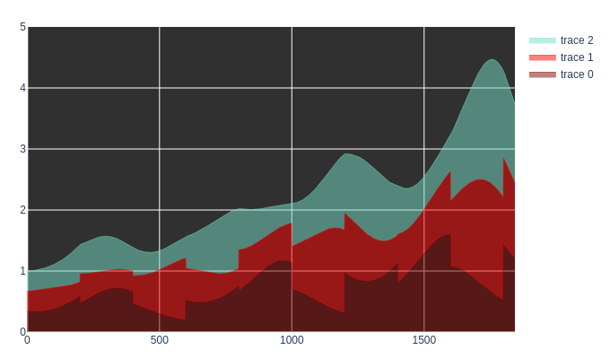

# The Bayesian Way

Ok, we cannot trust the [maximum likelihood](/words/maximum-likelihood-is-a-lie). So what's next, are we lost?
Nope, we are not. There is a light coming to save us, the light it's called *bayesian inference*.
You are a big boy, you already know the bayes theorem, no need for a recap.

Actually, maybe...

<section>

The idea of bayesian inference is that if you have some theories about a fact of the universe, but you are not sure which theory is the correct one, you can represent your uncertainty by assigning a probability to each theory. If we your theories $A$, $B$, $C$..., $P(A)$ will be how sure you are that theory $A$ is the correct one. We call *prior* the distribution of these probabilities.

Then an experiment is done, and you get new data $X$. Using the *Bayes theorem* you can find how confident you should be now of a theory, given the new information ($P(A|X)$). The updated probability distribution is called *posterior*.

Here our friend Bayes theorem:

$$
P(A|X) = \frac{P(X|A) P(A)}{\sum\limits_{\tiny{K\in\{A,B,...\}}} P(X|K) P(K)}
$$
</section>

How do we apply Bayes to our example?

1. We start with a prior describing the probability that the number of cards is $N=1$, or that is $N=2$, $N=3$...
2. Using the Bayes theorem we update it with the information that we extracted card number 14.
3. We'll have the posterior, telling us what's now our prediction for $N$.

Easy! Done! No problem at all! Child's game! Let's go home.

---

What are you saying? I hear some grumbling over there.
*"How am I suppose to choose a prior?"*, *"Picking one, over the infinite amount of possible priors, means deciding a priori that some values of $N$ are more probable than others. But I am supposed to know nothing about the deck, therefore that violates the problem."*, *"The result will strongly depend on my prior, especially in this settings, where I have only one data point."*, *"You know what would spare me from picking a prior? The maximu-"*

You sneaky sneaky bastard. I thought we had moved past that. But I'll fix you, I promise I'll convince you to drop the beast forever.
But we have to make a little de-tour for that. Close your eyes, grab my hand, take a deep breath and I'll bring you to a new beautiful place.

## The place

<section class="weird">

You open your eyes, you are in a busy street

In front of you there are two boxes. Inside one of them there is an unknown amount of candies, in the other one, twice as many. You don't know which box is which.

The magician explain the rules to you:

You pick the box you want and you open it. After counting the candies, you can decide to bring them home with you, **or**, you can switch box and bring home the candies in the other box. Only one little thing: for the ability of switching box, you have to pay a modest fee of 2% of the candies you'll find in the second box (even powerful magician have to pay the rent).

What do you do? (Your goal is to maximize the expected number of candies)

---

*"What kind of stupid riddle is this? Do you think I'm a fool?"* I know what you are thinking *"I have no idea which box contains the most candies, and even after I open the first box, I still have no idea which box contains the most candies. So why should I pay a fee for switching box? If whathever number I see in the first box, I always switch for the second one, then why not picking the second one directly, and avoid the fee? Keeping the box is obviously the best choice. Not even mr Maximum Likelihood would be stupid enough to switch box (well, maybe)."*

And you are right.

As you are approaching the box on the left the beaver starts talking to you: *"Let's suppose you'll find X candies in the first box. In the second one you expect to be 2X candies or X/2 candies, fifty-fifty. The expected values of candies in the second box is therefore $1/2 \dot 2X + 1/2 \dot 1/2X = 5/4 X$. Even after the 2% fee you are still better that sticking with the X you found in the first box. Switching is the best choice."*

---

He's right. You think again about it, the beaver is actually right. But you were right too. You are both right. Also, why is a beaver talking to you.
Anyway, you are both right. This cannot be, it's a paradox.

The earth start shaking, the walls crumble, the magician melts, the beaver explodes.

</section>

You destroyed it

---

## Test space

BLa bla bla bla
BLa bla bla bla
BLa bla bla bla

BLa bla bla bla
BLa bla bla bla
BLa bla bla bla
BLa bla bla bla
